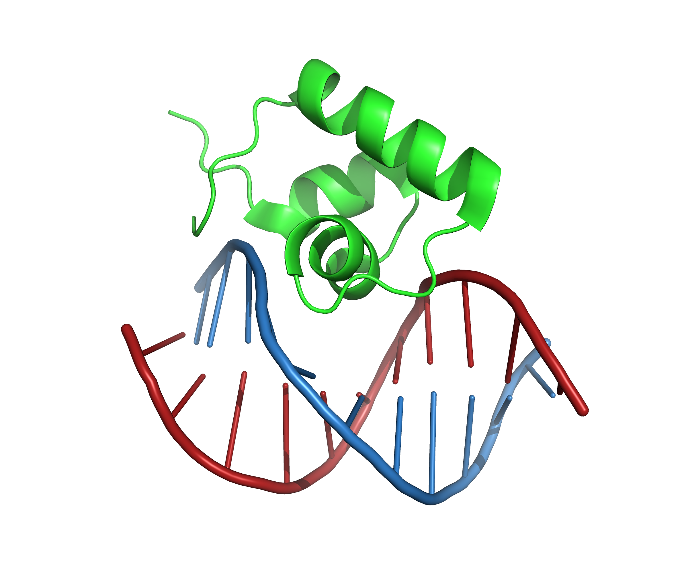
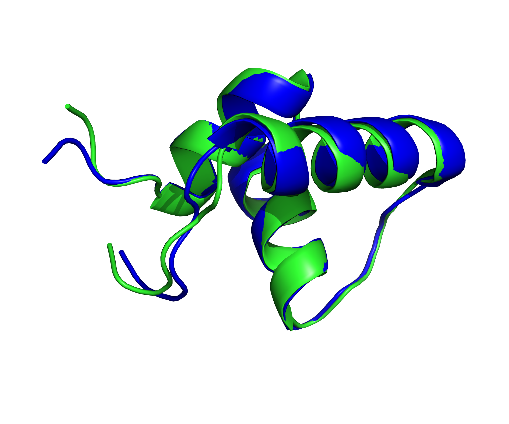

# Assignment 6 - Optimal RMSD algorithm 

## A) Introduction

The task of the exercise is to implement an algorithm to measure the difference between two protein structures based on the root mean square deviation (RMSD) score. The output of our algorithm should be the minimal RMSD between the two structures after superposition. Here we assume that the atoms of the two structures used are already paired, otherwise it would have been a more complicated problem to solve and for each alpha carbon in one protein we should have found its pair in the other one.  

The exercise is divided in two parts. In the first part, we use two points set (two 3 by 5 matrices) that represent the atomic coordinates of two polypeptides of five amino acids each, while in the second part we used two models of the same protein structure. This structure is determined by nuclear magnetic resonance (NMR) and the structures determined by this experimental method often consist of several models. In particular we calculate the RMSD between the carbon alpha of chain A of model 0 and model 1 of `1lcd`, which is the PDB structure of the lac repressor headpiece complex.

### Implementation

__Part 1__  
For the first part of the exercise I create a function that take two sets of vectors, representing the coordinates of the alpha carbons of the residues of two polypeptide chains. The function superimpose the two structures by applying a rotation matrix U that minimize the RMSD and return a tuple of three elements: the RMSD calculated by the closed formula, the RMSD calculated by rotating the coordinates and the rotation matrix U.  

In order to rotate a on top of b (in my code x and y, respectively), I first need to center the two sets of vectors in the center of their three dimensional space axis, which is equivalent to center them to their center of mass. Then I need to find the U rotation matrix to apply to b that result in the minimum RMSD, that can be done by singular value decomposition (SVD) of R (correlation matrix of a and b). Sometimes the minimum RMSD is given by an U that is a roto-reflection matrix, in that case I must change it into a rotation matrix since applying a reflection transformation to a protein will result in a different one.  

In order to calculate the RMSD by the first method I don’t use directly the rotation matrix U, the closed formula uses the average of the square root of the sum of the length of the two sets of vectors (E0) plus the sum of the s diagonal matrix components obtained from SVD of R (L(U)). For the second method I apply the U rotation matrix to b, than I calculate the square root of the average of the sum of the squared difference between the vectors length of a and rotated b.

__Part 2__  
I started by loading the PDB structure and selecting the models (0 and 1) and the chain A, than I create a function for extracting the alpha carbons from sane residues (excluding water molecules and residues with missing alpha carbon). The function take a chain as input, select only sane 
residues and return a 3 by n matrix (where n is equal to the number of residues in the chain) corresponding to the alpha carbons coordinates in the space.
After this initial step I used the function implemented in the first part of the exercise to superimpose the two structures and calculate the minimum RMSD with the two different methods.  

### PyMOL
First I show the 1lcd structure downloaded from PDB, the pictures are generated with pymol.

The green polypeptide is the chain A, the red one is chain B and the blue one is chain C. In the next picture I show the chain A of the first model (green) superposed to the chain A of the second model (blue).


When performing the superimposition of two structures, pymol also reports the calculated RMSD:  
RMSD = 0.751 (410 to 410 atoms).  
The RMSD calculated from pymol is slightly different from my result, but I calculate the RMSD from only 51 alpha carbons, while PyMOL use 410 atoms from a total of 554 atoms contained in the structure.

## B) Documented code

* __Part 1 - Work with toy proteins coordinates__

```python

from Bio import *
from Bio.PDB import *
from Bio.PDB.PDBParser import PDBParser

from numpy import *
from numpy.linalg import *

x = matrix([[ 18.92238689,  9.18841188,  8.70764463,  9.38130981,  8.53057997],      # x
        [ 1.12391951,  0.8707568 ,  1.01214183,  0.59383894,  0.65155349],           # y 
        [ 0.46106398,  0.62858099, -0.02625641,  0.35264203,  0.53670857]], 'f')     # z

y = matrix([[ 1.68739355,  1.38774297,  2.1959675 ,  1.51248281,  1.70793414],
        [ 8.99726755,  8.73213223,  8.86804272,  8.31722197,  8.9924607 ],
        [ 1.1668153 ,  1.1135669 ,  1.02279055,  1.06534992,  0.54881902]], 'f')

print(x.shape) # Check the shape of the popypeptide, should return a 3 by n matrix where n equal the number of residues

# Define a function that superimpose two chains by applying a rotation matrix U that minimize the RMSD
def calc_RMSD(chain_a, chain_b):
    """
    Take two sets of vectors representing the coordinates of the alpha 
    carbons and return a tuple of three elements containing the two RMSD 
    calculated by two methods and the rotation matrix U
    """

    # Call the previously define function to extract the C alpha
    x, y = (chain_a), (chain_b)

    # Calculate center of mass (we need to centre x and y, so move them to their center of mass)
    center_of_mass_x = x.sum(1) / x.shape[1]
    center_of_mass_y = y.sum(1) / y.shape[1]
    print("center of mass ", center_of_mass_x)

    # Center
    x_centered = x - center_of_mass_x
    y_centered = y - center_of_mass_y

    # Calculate R, the correlation matrix of x and y
    r = y_centered * x_centered.T 

    # Apply the SVD to R in order to find the rotation matrix U to apply to Y in order to minimize the RMSD
    v, s, wt = svd(r)                
    U = wt.T * v.T 

    # Check for reflection  
    z = diag([1,1,-1])                
    if round(det(U)) == -1:                               # here I should also change the sign of the third element of the s vector
        U = wt.T * z * v.T                                    
        print(round(det(U)) == 1, "Roto-reflection fixed")

    # Use the closed formula to calculate the RMSD (purely using linear algebra)
    len_x = norm(x_centered)                              # with x.A we can use x as array (element wise moltiplication) 
    len_y = norm(y_centered)
    E_0 = len_x**2 + len_y**2
    L_U = sum(s)
    if round(det(U)) == 1:
        RMSD_1 = sqrt( (E_0 - 2 * L_U) / x.shape[1])

    # Use the rotated coordinates to calculate the RMSD
    RMSD_2 = sqrt(sum((norm(x_centered - U * y_centered, axis = 0))**2) / x.shape[1]) # with axis = 0 output the sum of each col
    
    # Return the RMSD calculated by the two different methods and the rotation matrix U
    return(RMSD_1, RMSD_2, U)

part1 = calc_RMSD(x, y)
print("\n\nRMSD by formula and by rotated coordinates:\n", part1[0],";", part1[1],"\n")
print("Rotation matrix:\n", calc_RMSD(x, y)[2],"\n\n")
```

* __Part 2 - Work with PDB protein__

```python
# Load the PDB structure and select the models (0 and 1) and chain A
p = PDBParser(QUIET = True)
s = p.get_structure("1LCD", "1lcd.pdb")
chain_Ax = s[0]["A"]
chain_Ay = s[1]["A"]

# Define a function that extract the C alpha from a chain
def extract_c_alpha(chain):
    """
    Take a chain as input and return a matrix of alpha C coordinates, 
    where rows are x,y,z axis and columns are the vectors of alpha C 
    in the three dimensional space
    """
    c_alpha = [[],[],[]]
    # Iterate through all the residues in the chain
    for residue in chain:
        # Check if it is a residue (probably redundant)
        if is_aa(residue):
            # Check if res is sane (not water or missing CA)
            if residue.has_id("CA"):      
                # Get and store the coordinate of the C alpha                           
                ca = residue["CA"].get_vector()                      
                ca_x = ca[0]
                ca_y = ca[1]
                ca_z = ca[2]
                c_alpha[0].append(ca_x)
                c_alpha[1].append(ca_y)
                c_alpha[2].append(ca_z)
    # return the set of coordinates of the C alpha of the chain as 3 by n matrix, where n are the number of residues
    return (asmatrix(c_alpha))

part2 = calc_RMSD(extract_c_alpha(chain_Ax), extract_c_alpha(chain_Ay))

print("\n\nRMSD by formula and by rotated coordinates:\n", part2[0], ";", part2[1], "\n")
print("Rotation matrix:\n", part2[2])
```