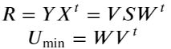
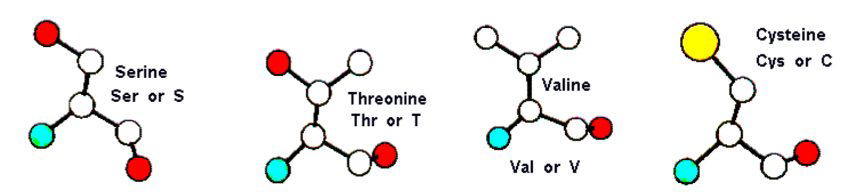
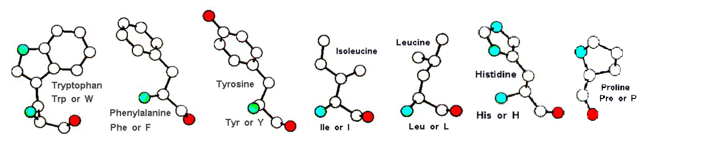
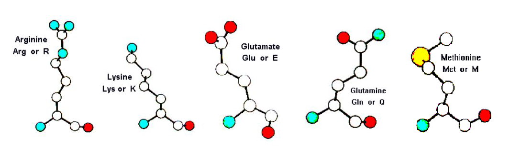
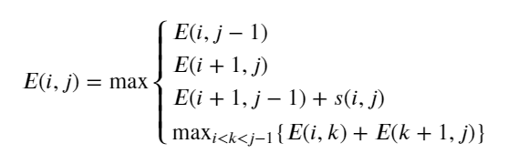
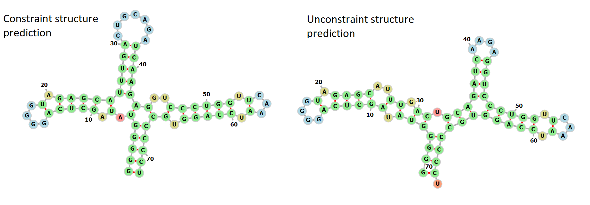
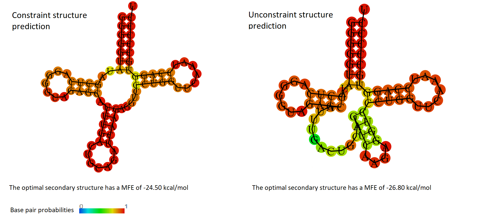

# Final exam
The exam is composed of three parts: protein theory, protein practice and RNA. The [theory part](https://github.com/St3451/Structural_Bioinformatics/blob/master/8_final_exam/Protein_theory.pdf) is about an interesting comparison between two revolutionary protein structure prediction methods, DeepMind's AlphaFold and AlQuaraishi's end-to-end prediction. The files [protein.py](https://github.com/St3451/Structural_Bioinformatics/blob/master/8_final_exam/protein.py) and [rna.py](https://github.com/St3451/Structural_Bioinformatics/blob/master/8_final_exam/rna.py) contain the code of the practical exercises..

------------------------------------------------------------------------------------------------------------------------------------------

## A) Protein practical part

Your task is to examine the variability in terms of RMSD of the side chains of the 18 amino acids excluding Gly and Ala. Gly and Ala are excluded because they lack degrees of freedom in their side chains due to their small size.   
* As protein data base, use the [top500](http://kinemage.biochem.duke.edu/databases/top500.php) collection of high quality protein structures.  
* Use Bio.PDB to implement the script.
     * Disregard any structures that cannot be parsed by the Bio.PDB parser, but ignore warnings.  
* For each of the 18 amino acids (Gly and Ala excluded), select 1000 pairs randomly sampled from the protein data set with replacement.
     * The two amino acids in each pair should come from different proteins.   
* Superimpose the side chain atoms using the optimal RMSD algorithm.
     * Side chain atoms are here defined as C-alpha, C-beta and anything attached beyond the C-beta. Main chain atoms (N, C and O) and hydrogens are excluded.
     * Make a well-justified decision on how you are going to center the atoms before applying the optimal RMSD superposition.
     * Make a histogram of the RMSD distribution for each of the 18 amino acids. 
          * Make sure all histograms use the same scale on the x- and y-axis.
     * Discuss and interpret the results.  

## 1. Introduction  
The task of this exercise is to investigate the distributions of RMSD scores between side chains pairs of 18 different amino acids. The two side chains from each pair should come from different proteins, this is a way to compare the variability of the amino acid structures and their differences. Gly and Ala are excluded from the analysis since their side chains are too small, and without enough degrees of freedom, to present a significative difference in terms of structural variability.  

## 2. Materials and methods  
For the exercise we used the Top500 database of PDB files, available from [Richardson Lab Web Site](http://kinemage.biochem.duke.edu/subindex.php#database). Richardson and colleagues, from Duke University, used this data for their Ramachandran and rotamer studies. This is a selection of 500 files from the Protein Data Bank (PDB) that are high resolution (1.8 Å or better), low homology, and high quality [1]. The PDB format provides a standard representation for macromolecular structure data derived from X-ray diffraction and NMR studies [2]. 

The programming language we used to perform the analysis is Python 3. In addition we used NumPy package to do operations with vectors and matrices, Matplotlib to plot the histograms and Bio.Python to work with the PDB files. In particular we used a Bio.Python module called Bio.PDB, the module has been developed by Thomas Hamelryck and focuses on working with crystal structures of biological macromolecules. It contains a parser for PDB files that makes the atomic information available in an easy-to-use but powerful data structure [3].

### 2.1. Implementation
For my implementation I used five functions that I will not completely report here to avoid redundancy. The first function extract the protein structures from a given directory. The second function extract the atoms coordinates of the side chain of a given residue, calculate the side chain center of mass and return the centered set of coordinates. The third function superimpose two side chains, represented by two 3 by N NumPy matrices, and return their minimum RMSD. The fourth function extract 1000 side chains pairs (of a certain amino acid) randomly sampled from the protein data set, and calculate their RMSD. The last function is used to make and save the plots of the RMSD distributions.

#### Parsing the structure
I start my implementation by parsing all the structure contained in the Top500H directory, try and except are used in order to ignore the structure that cannot be parsed by the PDBParser. I use the miscellaneous operating system interfaces (OS) module to access the PDB files contained in the directory.

```python
p = PDBParser(QUIET = True)
    list_structures = []
for filename in os.listdir(directory):
try:                                                            
    s = p.get_structure(filename, os.path.join(directory, filename))  
    list_structures.append(s)                                      
except:
    print(filename, "can't be parsed")
```

#### Extract side chain pairs
I select randomly two protein structures using random.choice() from NumPy package. Then I extract all the desired amino acids from each protein and, if both proteins contain the selected amino acid, I choose randomly one residue from each protein.

```python
# Select two random different proteins
i,j = random.choice(len(list_structures), size = 2, replace = False)   
s1 = list_structures[i]
s2 = list_structures[j]    
# Extract all the selected amino acid from the two selected proteins
list_res1 = []
for res in s1[0].get_residues(): 
    if res.get_resname() == aa:
        list_res1.append(res)
list_res2 = []
for res in s2[0].get_residues(): 
    if res.get_resname() == aa:
        list_res2.append(res)    
# Check if both proteins have the selected amino acid
if len(list_res1) != 0 and len(list_res2) != 0:
    # Select randomly one amino acid from each of the two proteins
    i1 = random.choice(len(list_res1))
    i2 = random.choice(len(list_res2))
    res1 = list_res1[i1]
    res2 = list_res2[i2]
```

Then I obtain the centered coordinates of their side chains (method described in the next subsection) and, if the two side chains have the same number of atoms, I compute the RMSD score.

```python
    # Get the centered coordinates of the two side_chains
    sc1 = get_centered_sidechain(res1)
    sc2 = get_centered_sidechain(res2)
    # Check if the side chains have the same number of atoms
    if sc1.shape == sc2.shape:
        # Calculate RMSD and append it to the RMSD list
        rmsd = calc_RMSD(sc1, sc2)
        rmsd_list.append(rmsd)
```
#### Optimal RMSD superposition
The implementation of the RMSD algorithm (and most of the rest of the code) is based on weekly exercises solutions provided by our Structural Bioinformatics professor Thomas Hamelryck [4]. 

In order to measure the structural similarity between side chain pairs, we used the root-mean-square deviation (RMSD) of atomic positions which is simply the square root of the distance between all atoms divided by their number.  
We want to apply a U rotation matrix to y, until the RMSD is minimized.  


In the exercise the centers of mass of the two sets of vectors used for the RMSD calculation are not at their origin, so I centered the atoms before applying the optimal RMSD superposition. Since the task was to compare the structural similarities between side chains of the same amino acid, I calculated the center of mass (COM) by adding all the coordinates of the side chain atoms to a vector, including the alpha carbon and excluding all hydrogen. Then I divided that vector for the number of atoms (N).  


Finally I centered the atoms by subtracting the center of mass to each coordinate vector in the set. Once I obtained the centered coordinates, I wanted to find the rotation matrix U that minimize the RMSD score, so I applied the singular value decomposition (SVD) to the correlation matrix R.  


Sometimes the rotation matrix U that minimize the RMSD is aroto-inversion, that will superimpose a mirror image. To avoid that we have to multiply the components of the rotation matrix U for Z = diag(1,1,−1), and we also change the sign to the third element of the diagonal matrix S (even that this is not necessary in the calculation of the RMSD from the coordinates). Than I applyed the rotation matrix U to y and I finally calculated the RMSD from the two set of coordinates.  

## 3. Results
The final results of the exercise are the [plots of the RMSD scores distributions](https://github.com/St3451/Structural_Bioinformatics/blob/master/8_final_exam/rmsd_histograms/README.md) of the 18 different amino acids. It is possible to observe that, with some exceptions (ASN and ASP), they show three main distributions shapes.


## 4. Conclusions
It is possible to observe that the distributions of RMSD scores exhibit certain patterns depending on the flexibility of the side chain, their size and other characteristics.  

Serine, Threonine, Valine and Cystein have the smallest side chain and they have a more compact structure. As expected they have the lowest RMSD score and exhibit the lowest variability in the score, meaning that they have the lowest ability to move in the three-dimensional space.  


Tryptophan, Phenylalanine, Tyrosine, Isoleucine, Leucine, Proline and Histidine are the amino acids that present a characteristic pattern in their structural variability. In particular, they show a clear bimodal distribution of their RMSD scores, that may indicate that they can be found in two main different spatial arrangements. Probably the most reasonable explanation of this phenomenon is that, since most of these amino acids are present in β-sheets, the two peaks may be related to the fact that the side chains alternately point in opposite directions from the sheet.  


Arginine, Lysine, Glutamate, Glutamine and Methionine are the amino acids that present the largest RMSD scores and have the largest variability in their distributions. With the exception of Methionine they are polar amino acids, they all have long side chains and, as it is possible to observe, due to the nature of their structure they have less constraints than others amino acids and they are therefore more flexible and have more freedom of movement.  


## References
[1] S.C. Lovell, I.W. Davis, W.B. Arendall III, P.I.W. de Bakker, J.M. Word, M.G. Prisant, J.S. Richardson, and D.C. Richardson     (2003) "Structure Validation by Cα Geometry: φ,ψ and Cβ Deviation" Proteins: Structure, Function and Genetics 50:437-450.

[2] H.M. Berman, K. Henrick, H. Nakamura (2003) Announcing the worldwide Protein Data Bank Nature Structural Biology 10 (12): 980.

[3] Hamelryck, T., Manderick, B. (2003) PDB parser and structure class implemented in Python. Bioinformatics 19: 2308–2310

[4] Thomas Hamelryck. Associate professor, Computational and RNA Biology; University of Copenhagen.

------------------------------------------------------------------------------------------------------------------------------------------

## B) RNA part

The overall accuracy of RNA secondary structure prediction can be improved if for some stretches of the RNA sequence the structure is known. Knowledge about such substructures could come from either experimental or computational studies. Here, we will extend the Nussinov algorithm to consider a single known substructure at a given location. In addition, we require a minimum loop length of 3.

1. Explain how this constraint can be implemented (hint: consider the initialization of the dynamic programming matrix). Then implement this constraint folding in your choice of Nussinov implementation (your own or one of those already available).

2. Use your implementation to predict the structure of the sequence:
```
Sequence: GGGGGUAUAGCUCAGGGGUAGAGCAUUUGACUGCAGAUCAAGAGGUCCCUGGUUCAAAUCCAGGUGCCCCCU
```
for which the following substructure is already known (from position 26 to 42):
```
Constraint: .........................(((((xxxxxxx)))))..............................
```

3. Predict the structure for the full sequence (without the folding constraint); again set the minimal loop length to 3. Then, compute the base pair distance between the two dot-bracket strings you have obtained (with/without folding constraint). Discuss the difference in the structure and provide a sketch of the two structures. Does one of the structures resembles a known structure?

4. Annotate the RNA sequence by a method of your choice. Which structure prediction (constraint/unconstraint) is compatible with the annotation?

5. Run the [RNAfold](http://rna.tbi.univie.ac.at/cgi-bin/RNAWebSuite/RNAfold.cgi) webserver without and with constraint. Compare the foldings and describe your observations.

## 1. Introduction
The Nussinov algorithm is historically the first attempts at RNA secondary structure prediction. It is a dynamic programming algorithm that, given a RNA sequence, recursively finds the secondary structure that maximize the number of base pairs. In the Nussinov algorithm we first initialize a scoring matrix, we decide a minimum loop size and then we start filling each cell by iterating through the diagonals of the matrix. We can give a score to a cell 𝑖,𝑗 by looking at the three neighbor cells and the possible branching structures (bifurcation). We can give a score to a cell 𝑖,𝑗 by looking at the three neighbor cells and the possible branching structures (bifurcation). If we consider 𝐸(𝑖,𝑗) as the maximum number of base pairs for the subsequence 𝑥\[𝑖;𝑗\] , than 



where  𝑠(𝑖,𝑗)  can be just  1  in case of base pair or can have different scores (3,2,1) depending on the specific bases that form a pair in that cell. After the matrix is filled, the optimal RNA secondary structure is obtained by backtracking from the top right cell.
The Nussinov algorithm is a really simplified version of RNA folding and it has several limitations. It has a computational complexity 𝑂(𝑁^3) and cannot consider pseudoknots, otherwise the computational complexity could reach 𝑂(𝑁^6). An other problem is the ambiguity because often the same structure can be procuded in several ways and the structures with the maximum number of base pairs are often not unique.  

Δ𝐺_𝑙𝑜𝑜𝑝(𝑛) = Δ𝐺_size(𝑛) + Δ𝐺_sequence + Δ𝐺_special, in this way this method provide a much better prediction and an unambiguous solution to the folding problem using free energy minimization.

## 2. Materials and methods

### Nussinov implementation
For the exercise I used my implementation of the Nussinov algorithm using weighted scores (𝜖(𝐶,𝐺) = 𝜖(𝐺,𝐶) = −3,   
𝜖(𝐴,𝑈) = 𝜖(𝑈,𝐴) = −2, 𝜖(𝐺,𝑈) = 𝜖(𝑈,𝐺) = −1), it is based on Giulia Corsi [4] implementation and on line guides I received in week 3 lecture exercise of Structural Bioinformatics. I start by generating a matrix (a list of list) that will be initialized with all zeros. Than I proceed by iterating through the diagonals of half of the matrix assigning a score to each cell.

```python
# Iterate through the diagonals  
for n in range(min_loop_size + 1, len(seq)):                      
        for j in range(n, len(seq)):                             
            i = j - n                                             
            score_cell(seq, con, matrix_lst, i, j, min_loop_size)
```

The scoring of each cell is performed by considering the three neighbor cells and the branching structure with the highest score.

```python
# The score list will store the scores of the four options for obtaining a cell
score_list = []
    bp_score = 0
    # Check if there is a base pair and attribute the relative score
    if (seq[i] == "A" and seq[j] == "U") or (seq[i] == "U" and seq[j] == "A"):
        bp_score = 2
    elif (seq[i] == "G" and seq[j] == "C") or (seq[i] == "C" and seq[j] == "G"):
        bp_score = 3
    elif (seq[i] == "G" and seq[j] == "U") or (seq[i] == "U" and seq[j] == "G"):
        bp_score = 1
    # Append the score of the diagonal cell plus the base pair score
    score_list.append(score_matrix[i+1][j-1] + bp_score)  
    # Append the score of the left cell
    score_list.append(score_matrix[i][j-1])                 
    # Append the score of the bottom cell
    score_list.append(score_matrix[i+1][j])                 
    # Append the score of the branching structure with highest score
    k_scores = []                                          
    for k in range(i,j - minimum_loop_size):
        score = score_matrix[i][k] + score_matrix[k+1][j]
        k_scores.append(score)
    score_list.append(max(k_scores))
    # Score the matrix with the highest score between the four options
    score_matrix[i][j] = max(score_list)  
```      

Another important part of the algorithm is the backtracking, it allows to obtain the optimal structure represented by a dot brackets notation string. I first initialize a dot bracket list filled with dots, then I used the backtracking function implemented by Giulia Corsi [4]. Giulia function use recursion and starting from the top right corner of the matrix, move to the cell from which the score at that position has been obtained. If the score derives from a bifurcation, the function calls itself (recursion) for obtaining the two optimal substructures. It is interesting to note that changing the order of the if statement often result in a different structure, that occurs because the Nusinov decomposition is ambiguous and there may be different structures with the same maximum number of base pairs.  

### Constraint implementation
In order to obtain the constraint requested in the exercise I simply added three conditions in the scoring function, and I added the option `constraint` as an argument of the function. If the constraint is set to true and a constraint sequence is added, the function will look at each position of the constraint sequence. If it finds "(" and ")" at position 𝑖,𝑗 it will only allow base pairs, if it finds an "x" at position 𝑖 or 𝑗 it will not allow any base pairs, and finally if it finds a "." at position 𝑖 and 𝑗 it will not give any restriction. Then the bifurcation score is added as usual.

```python
# Check if there is a base pair: if yes force to have base pair
if (constraint[i] == "(" and constraint[j] == ")") or (constraint[j] == "(" and constraint[i] == ")"):
    if (seq[i] == "A" and seq[j] == "U") or (seq[i] == "U" and seq[j] == "A"):
        bp_score = 2
    elif (seq[i] == "G" and seq[j] == "C") or (seq[i] == "C" and seq[j] == "G"):
        bp_score = 3
    elif (seq[i] == "G" and seq[j] == "U") or (seq[i] == "U" and seq[j] == "G"):
        bp_score = 1
    score_list.append(score_matrix[i+1][j-1] + bp_score)   
# Check if the base pair is forbidden: if yes force to avoid base pair
elif (constraint[i] == "x" or constraint[j] == "x"):
    score_list.append(score_matrix[i][j-1])                 
    score_list.append(score_matrix[i+1][j])                 
# Check if there are not constraints: if yes don't use restrictions
elif (constraint[i] == "." and constraint[j] == "."):
    ...
```     

If the constraint is set to False, a dot brackets sequence containing all dots will be generated and it will be used as constraint sequence, therefore allowing all possible structures.

```python
def dinamic_programming_folding(seq, con, matrix_lst, min_loop_size, constrain = False):
    if constrain == False:
        con = create_lst_db(seq)
```

## 3. Results

### Results of applying my implementation
The base pair distance between the two dot-bracket strings I obtained is 29.


### Sketch of the two structures
The structure obtained by the constraint structure prediction (on the left) resemble a tRNA structure but, especially in the area close to the central inner loop, it has an excessive amount of base pairs. The structure predicted with unconstraint prediction (on the right) doesn't resemble any known structure. The sketch of the structures is obtained with [forna](http://rna.tbi.univie.ac.at/forna/), it is a RNA secondary structure visualization tool provided by the University of Vienna [8].  



#### Annotation.
In order to annotate the sequence I performed a search in the Rfam database, which is a collection of RNA families, each represented by multiple sequence alignments and consensus secondary structures [5]. As expected the result of my search is that the sequence is a tRNA. The structure prediction compatible with the annotation is the constraint one.

### RNAfold webserver.
Running the [RNAfold](http://rna.tbi.univie.ac.at/cgi-bin/RNAWebSuite/RNAfold.cgi) webserver [9] with both constraint and uncontraint structure prediction is possible to observe that, even if the MFE of the structure obtained by unconstraint prediction is lower (-26.80kcal/mol) than the MFE obtained with constraint prediction (-24.50kcal/mol), the first one (figure on the right) has a really large variable loop which is not found in tRNA structures. Its base pair probabilities in the additional loop and anticodon stem are lower than the base pair probabilities found in the structure predicted with constraint, suggesting that the structure obtained with constraint prediction is closer to the real one.  



### Energy folding model.
The MFE folding predict the secondary structure of an RNA sequence by minimizing its free energy, the algorithms based on this method attempt to find the structure of minimal free energy among all possible structures. As mentioned in the introduction, while the Nussinov algorithm attempt to obtain the optimal structure by simply maximizing the number of base pairs, the full energy model ( loop-based energy model or nearest neighbor model) consider the stacking interactions between bases and finds the minimum free energy optimal structure by distinguish which type of loop is closed by each pair [3]. In this more complex model, the secondary structure can be uniquely decomposed into loops (loop decomposition) and the total free energy of a structure become the sum over the energy of its constituent loops [1]. 

## 4. Conclusions
The loop-based energy model provide a much better prediction than the Nussinov algorithm. In fact, as we observed in the results, often the base pairs maximization doesn't reflect biological structures. We also observed that the accuracy of the prediction can be increased forcing the algorithm to produce a known substructure in a specific location. One useful method for analyzing the possible alternative structures of a given sequence is the partition function calculation for RNA secondary structure. Basically, the partition function prediction will not consider only the optimal MFE structure but it will provide the base pair probabilities considering all possible structures. Other advanced methods, like the energy-based RNA consensus secondary structure prediction (e.g. RNAalifold program), extend the RNA structure prediction algorithm based on the loop-based model. These methods consider the energy contributions of all sequences in the alignments and add phylogenetic information into the energy model [6]. Finally, there are also methods the simultaneously align and predict the secondary structure of multiple RNA sequences by free energy minimization. These methods, based on the Sankof algorithm, have the advantage to increase the accuracy of the prediction but the disadvantage is that they require an increased computational memory. Therefore, in order to decrease the computational complexity, all the implementations that use these methods are heuristic solutions [7].

## References
[1] Hofacker, I. L., Stadler, P. F., & Stadler, P. F. (2006). RNA Secondary Structures. Encyclopedia of Molecular Cell Biology     and Molecular Medicine.

[2] Gorodkin Jan; Hofacker, Ivo L.; Ruzzo, Walter L. (2014) Concepts and introduction to RNA bioinformatics. Methods in molecular biology, 1097:1-31.

[3] Hofacker IL. (2014) Energy-directed RNA structure prediction. Methods Mol Biol. 1097:71-84.

[4] Giulia Corsi. PhD fellow Animal Genetics, Bioinformatics and Breeding. University of Copenhagen.

[5] Sam Griffiths-Jones, Alex Bateman, Mhairi Marshall, Ajay Khanna and Sean R. Eddy. (2019) Rfam: an RNA family database.

[6] Washietl S1, Bernhart SH, Kellis M. (2014) Energy-based RNA consensus secondary structure prediction in multiple sequence alignments. Methods Mol Biol. 1097:125-41.
    
[7] Havgaard JH1, Gorodkin J. (2014) RNA structural alignments, part I: Sankoff-based approaches for structural alignments. Methods Mol Biol. 1097:275-90.
    
[8] Kerpedjiev P, Hammer S, Hofacker IL. (2015) Forna (force-directed RNA): Simple and effective online RNA secondary structure     diagrams. Bioinformatics 31(20):3377-9.

[9] Ivo L. Hofacker. (2003) Vienna RNA secondary structure server. Nucleic Acids Res. 31(13): 3429–3431.
