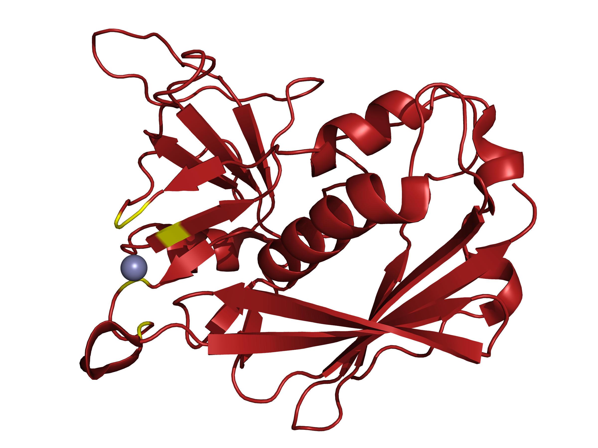
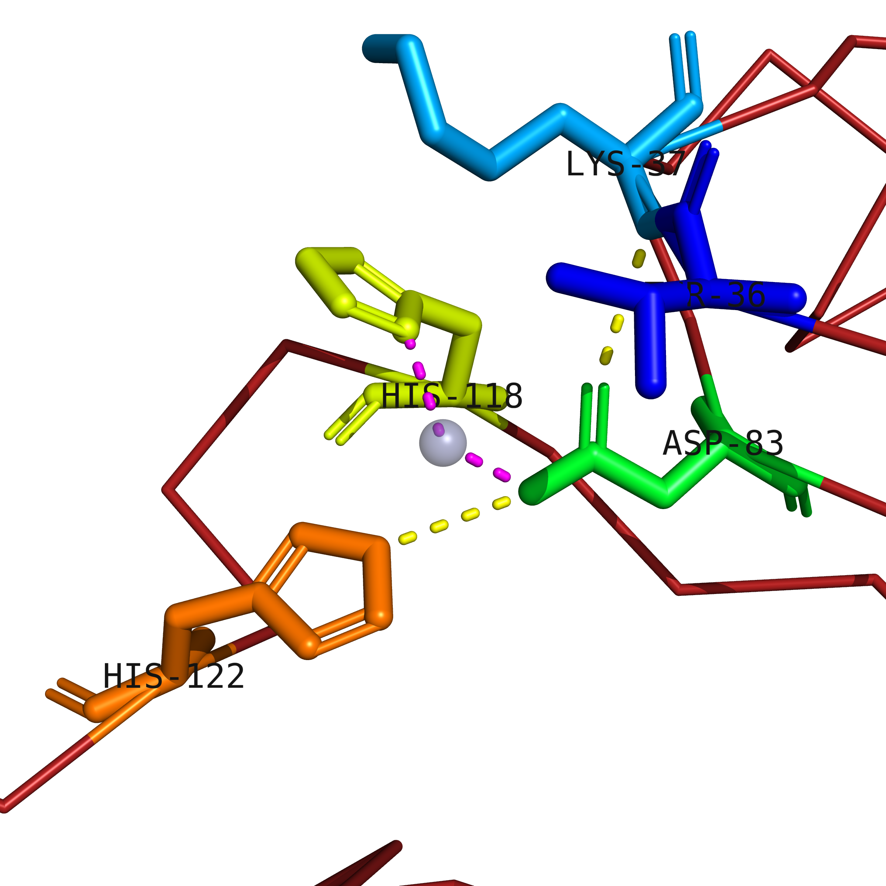

# Assignment 2 - PyMOL and PDB

* Pick (any) 3 consecutive letters from your first or last name and look up the corresponding PDB file.
* Briefly describe the structure (biology, ligands, experimental method etc.)
* Discuss structure quality.
* Discuss content of biological and asymmetrical unit. Are they the same? 
* Make two pictures of the content of the PDB file, with suitable captions.
* Submit as a PDF file.

## Execution

### Biology and structure

1STE is the PDB database ID of the SEC2 protein,  it is an enterotoxin type C-2 protein produced by Staphylococcus Aureus. It is a superantigen that activates the host immune system by binding to major histocompatibility (MHC) complex class II and T-Cell receptors. It is one of the causes of food poisoning. SEC2 is composed by a single polypeptide chain (type A) and its crystal structure reveal a zync-binding site (1.00 occupancy). The experimental method used is the X-ray diffraction.   
Structure quality
• The resolution is 2Å (acceptable)  
• R-factor is 25 (acceptable)  
• B-factor: there are no electron density maps for this structure, so the information about the B-factor is not available  
• Ramachandran plot: 1.7% outliers (bad)  
• Side chains: 3,9% outliers (bad)  

The resolution and R-factor of the 1STE file are acceptable but there are several outliers and the information about the B-factor is not available. So even if it has a decent resolution, since there may be several errors in the model I think that the overall quality is not so good.
 
### Biological and asymmetric unit

The biological and asymmetric unit are the same.  

### Two pictures of the PDB file with captions
   * __Picture 1__

The picture represent the overall structure of the SEC2 protein. Its type A chain is composed of alpha helix, beta sheets and other secondary structures. The grey sphere represent the zinc ion which has interactions with the yellow portion of the protein. 

   * __Picture 2__

 
 This picture illustrate the five amino acids that interact with the zinc ion (black sphere). Hiss-122 (orange), Hiss-118 (yellow) and Asp-83 (green) bind to the ligand and the bonds are represented by grey dashed lines, while Lys-37 (light blue) and Thr-36 (dark blue) have an indirect interaction. The yellow dashed lines represent the hydrogen bonds between the amino acids that interact with the metal.
