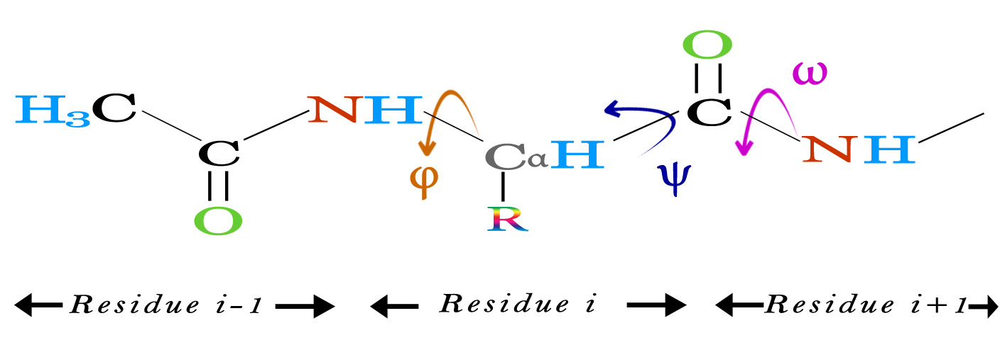

# Assignment 5 - Biopython's Bio.PDB

Use trypsin/trypsin inhibitor complex, pdb code `2PC`.
1. Find all residues in trypsin that have more than two close contacts to the inhibitor.
    * A "close contact" is any atom pair with distance lower than 3.5 Å.
2. Print (phi, psi) angles for both proteins, using Polypeptide class and using your own code (use `calc_dihedral`)
    * Check if the (phi, psi) angles for the second amino acid match.
3. Output Trypsin to a separate PDB file.
4. Output all atoms within a sphere of 10 Å of the center of trypsin to a separate PDB file. Use the CA atoms to calculate the center.

```python
#### I must specify that for this assignment I used code provided by my Structural Bioinformatics
#### professor Thomas Hamelryck (Associate professor, Computational and RNA Biology; University of
#### Copenhagen), which is also the main author/maintainer of the Bio.PDB module.
```

## Exercise 1

```python
# Import modules
from Bio import *
from Bio.PDB import *
from Bio.PDB.PDBParser import PDBParser

# Create parser object and load structure
parser = PDBParser()
structure = parser.get_structure("Trypsin", "2ptc.pdb")

# Check if two residues are close
def is_close(res1, res2):
    """Return True if two residues have more than two
    contact that are less than 3.5 angstroms apart"""
    count = 0
    for atom1 in res1:
        for atom2 in res2:
                if abs(atom1 - atom2) < 3.5:
                    count += 1
                    if count > 2:
                        return True
    return False

chain_E = structure[0]['E']
chain_I = structure[0]['I']
close_residues = []

# Compare all enzyme and inhibitor residues
print("\nComparing chain E to chan I")
for residue_E in chain_E:
    for residue_I in chain_I:
        if is_close(residue_E, residue_I):
            close_residues.append((residue_E, residue_I))

# Output on the screen
print("%s pairs found" % len(close_residues))
for res1, res2 in close_residues:
    print("%3s-%3d is close to %3s-%3d" % (res1.get_resname(), res1.get_id()[1], res2.get_resname(), res2.get_id()[1]))
```

## Exercise 2

```python
# Print phi and psi angles for both proteins using Polypeptide class
ppb = PPBuilder()
pp_list = ppb.build_peptides(structure) # Create a list of polypeptide objects

for pp in pp_list: # Just to check what we just created
    print(pp)
    for residue in pp:
        print(residue)

def find_phi_psi(structure):
    """Calculate phi,psi dihedral angles and return lists.
    Uses the polypeptide class. A polypeptide is a normal (index zero-based)
    list of residues that are covalently bonded to the next and previous
    list element. No waters or ions."""
    phi_list = []
    psi_list = []

    for pp in pp_list:
        for phi, psi in pp.get_phi_psi_list(): 
            phi_list.append(phi)
            psi_list.append(psi)

    return phi_list, psi_list

phi_list, psi_list = find_phi_psi(s)
print("Phi angle:")
print(phi_list[1])
print("Psi angle:")
print(psi_list[1])

# Print phi and psi by own implementation
def calc_psi_phi(res1, res2, res3):                   # we need a function that take three residues (r-1, r, r+1):
    n = res2['N'].get_vector()                        #               r-1 ;       r      ; r+1                
    ca = res2['CA'].get_vector()                      #                C  ; N, Calpha, C ;  N
    c = res2['C'].get_vector()                        # from r-1, r   ( 4 atoms for phi  )          
    # Calculate phi                                   # from r, r+1       (  4 atoms for psi )            
    cp = res1['C'].get_vector()                       # cp = carbon previous residue (r-1)
    phi = calc_dihedral(cp, n, ca, c)
    # Calculate psi
    nn = res3['N'].get_vector()                       # nn = nitrogen next residue (r-1)
    psi = calc_dihedral(n, ca, c, nn)
```



## Exercise 3

```python
# Define a class based on Bio.PDB.Select to output chain E only
class E_Select(Select):
    def accept_chain(self, chain):
        if chain.get_id()=='E':
            return True
        else:
            return False

# Create PDBIO object
io = PDBIO()

# Set the structure
io.set_structure(structure)

# Filename to save to
outfile = 'out.pdb'

# Create an object of class E_Select defined previously
select = E_Select()

# Save the structure using the E_Select object as filter
io.save(outfile, select)
print("Printed %s" % outfile)
```

## Exercise 4

```python
# Define a class based on Bio.PDB.Select to output only atoms close to the center of mass 
class CenterSelect(Select):
    def __init__(self, center):
        self.center = center                        # Set center of molecule (will be determined by com)

    def accept_atom(self, atom):
        """Accept atoms close to center"""
        diff = self.center - atom.get_vector()      # Diff between com and the atom position (vector)
        dist = diff.norm()                          # .norm for length
        if dist < 10:
            return True                             # True and False or 0 and 1 are used for filtering by PDBIO
        else:
            return False

# Select chain E
enzyme = structure[0]["E"]                           # model 0, chain E

# Find CA center-of-mass                             # center-of-mass = sum(CA vectors) / (n. CA vectors)
n = 0                                                # CA counter
atom_sum = Vector(0., 0., 0.)                        # Bio.PDB.Vector to calculate center-of-mass (com)

for res in enzyme:
    if res.has_id("CA"):                             # Check if res is sane (not water or missing CA)
        atom_sum += res["CA"].get_vector()           # Add the CA vector to the atom_sum
        n += 1                                       # Add 1 to the counter

com = atom_sum ** (1/n)                              # ** multiplies Vector with Vector or scalar                               
print(com)                                           # For debugging

## Output with selection
io = PDBIO()                                         # Create PDBIO object
io.set_structure(structure)                          # Set the structure
outfile = '2ptc-center.pdb'                          # Filename for saving
 
# Create an object of class CenterSelect defined previously and pass the calculated center-of-mass
select = CenterSelect(com)

# Save structure using CenterSelect filter
io.save(outfile, select)
print("Printed %s" % outfile)
```