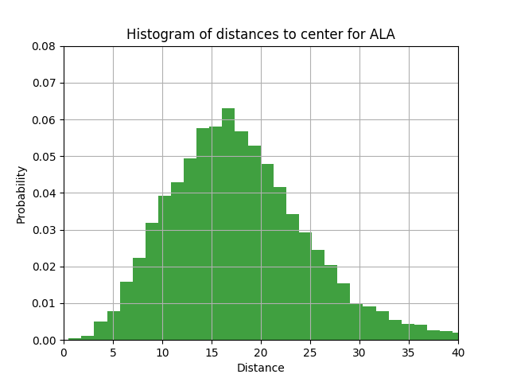
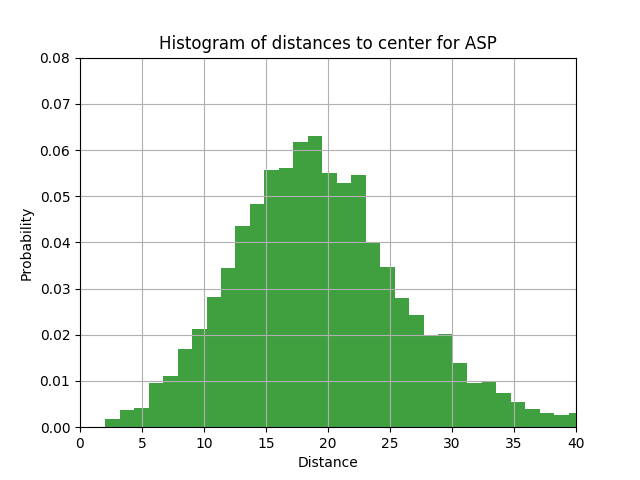
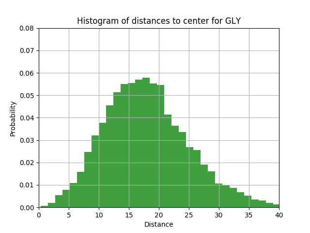
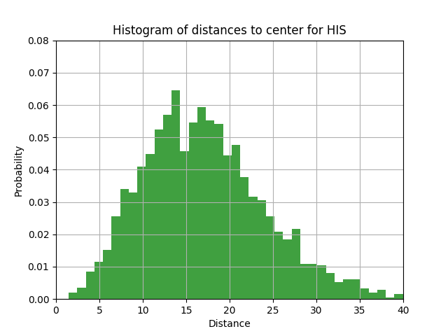
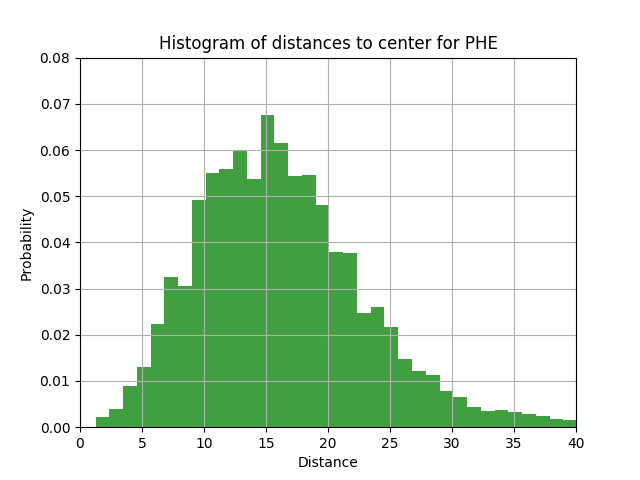
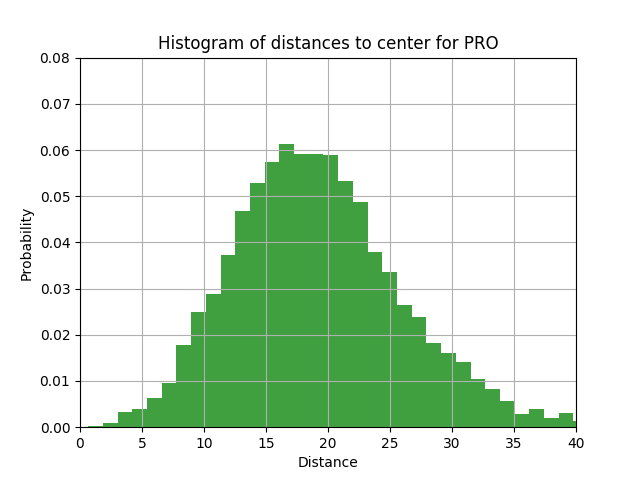

# Assignment 7 - Distance histogram exercise

Your task is to plot histograms (in PNG format) of the distances of the C-alpha atoms of various amino acids to the center of their proteins.

* Do this for ALA, GLY, PRO, HIS, ASP and PHE.
    * Calculate the mean and standard deviations for their distances.
        * Tip: you can use numpy for this.
    * Print the number of amino acids found for each type.
* For the center of a protein, simply use the average of the coordinates of all C-alpha atoms.
* Parse the PDB files using Biopython's [Bio.PDB](https://biopython.org/wiki/The_Biopython_Structural_Bioinformatics_FAQ).
* Use the [top500 database] (http://kinemage.biochem.duke.edu/databases/top500.php) as data set.
    * Ignore structures that throw errors on parsing.
    * Tip: test your code on just a few structures.
* Use [matplotlib] (https://matplotlib.org/api/_as_gen/matplotlib.pyplot.hist.html) for plotting the histograms (use [savefig] (https://matplotlib.org/3.1.1/api/_as_gen/matplotlib.pyplot.savefig.html)). 
    * Label the plots adequately.
    * Make sure the plots have the same x- and y-scale.
Are the results what you expected?

## Implementation

```python
#### I must specify that the code for this assignment (and assignment 5) has been provided by my 
#### Structural Bioinformatics professor Thomas Hamelryck (Associate professor, Computational and RNA 
#### Biology; University of Copenhagen), which is also the main author/maintainer of the Bio.PDB module.
```

```python
from Bio import *
from Bio.PDB import *
from Bio.PDB.PDBParser import PDBParser

import matplotlib.pyplot as plt
import numpy as np

# Calculate the enter of mass (average of the cooridnates of all CA of the protein)
def calc_center(structure):
    """
    Returns center of structure s as vector.
    """
    ca_sum = Vector(0., 0., 0.)
    n = 0
    for residue in structure[0].get_residues():
        if is_aa(residue):
            try:
                # extract CA coordinate
                if residue.has_id("CA"):
                    ca_sum += residue["CA"].get_vector()
                    n += 1
            except:
                print(residue, " skipped, no CA atom")  
    center = ca_sum ** (1/n)  # cross product multiply a vector for a number
    return(center)

def calc_distance(structure, aa_name, center):
    """
    For given center vector and structure s, return list of 
    distances for amino acid type aa_name.
    """
    rlist = [] 
    assert(is_aa(aa_name)) # Make sure aa_name is amino acid
    for residue in structure[0].get_residues():
        if residue.get_resname() == aa_name:
            try:
                # Calculate distance
                ca = residue["CA"]
                vector = ca.get_vector()
                diff = vector - center
                r = diff.norm()
                rlist.append(r)
            except:
                pass
    return(rlist)

def save_histogram(rlist, aa):
    """
    Make histogram and save as png file.
    """
    # The histogram of the data
    n, bins, patches = plt.hist(rlist, 50, density=True, 
        facecolor='g', alpha=0.75)
    # Labels
    plt.xlabel('Distance')
    plt.ylabel('Probability')
    plt.title('Histogram of distances to center for %s' % aa)
    # x and y limits of plot
    plt.xlim(0, 40)
    plt.ylim(0, 0.08)
    plt.grid(True)
    # Save
    plt.savefig("/home/lpp/BIOINFORMATICS/sb2019/week7/dist_hist_"+aa+".png")
    # Clear canvas for next plot
    plt.clf()

# what is after this condition is not executed if I import this script as module
if __name__=="__main__":  
    import glob

    # Dictionary of global distance lists for given amino acids
    aa_names=["ALA", "GLY", "PRO", "HIS", "ASP", "PHE"]
    rlists={}
    for aa in aa_names:
        rlists[aa]=[]

    p = PDBParser(QUIET = True) # Quiet ignore warnings 
    s_protein_list = []
    directory = "/home/lpp/BIOINFORMATICS/sb2019/week7/top500H"
    for filename in os.listdir(directory): 
        print("parsing ", filename, "...")
        try:
            # Get structure                                                                
            s = p.get_structure(filename, os.path.join(directory, filename))  # create the structure
            # Calculate center
            center = calc_center(s)
            # Calculate distance lists and append to global distance lists
            calc_distance(s, "ALA", center)
            for aa in aa_names:
                rlists[aa] += calc_distance(s, aa, center)
        except:
            print(filename, " can't be parsed")
    
    # At this point I have a dictionary with a list of distances for each amino acid
    for aa in aa_names:
        # Print count, mean, standard deviation
        print("\n")
        l = len(rlists[aa])
        print("Count for %s: %i" % (aa, l))
        m = np.mean(rlists[aa])
        print("Mean for %s: %.2f" % (aa, m))
        sd = np.std(rlists[aa])
        print("Std. dev.  for %s: %.2f" % (aa, sd))
        # Save histogram
        save_histogram(rlists[aa], aa)
```







